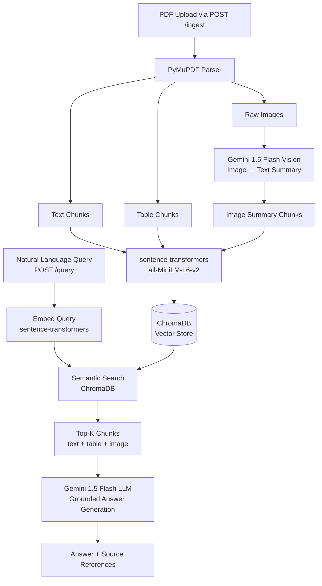

# Tata Motors Multimodal RAG System

> **BITS WILP — Multimodal RAG Bootcamp | Individual Assignment**

---

## Problem Statement

I work in the Commercial Vehicle Business Unit (CVBU) at Tata Motors, supporting aftersales operations across workshops spread across India. In this domain, a service advisor's ability to quickly retrieve accurate technical information directly determines the quality of customer service — and ultimately, vehicle uptime for fleet operators who depend on commercial vehicles for their livelihoods.

The challenge we face daily is not a lack of information. It is an overwhelming *abundance* of it, fragmented across thousands of documents in formats that were never designed to be queried together.

A Tata Motors service advisor today has access to over **2,600 service circulars** (PDFs), **1,500 ICG files** (Improvement Campaign Goodwill — free retrofit instructions in Word format), **1,500 ICM files** (Improvement Campaign Mandatory — design change records in Excel), and **180 workshop manuals** totalling upwards of 18,000 pages. Each of these document types is structurally different. Service circulars are dense PDFs with both narrative text and specification tables — for example, a service schedule for the LPO 1618 bus will contain maintenance intervals as structured tables alongside narrative paragraphs explaining conditions and exceptions. Workshop manuals are richly multimodal: they contain torque specification tables, step-by-step textual procedures, and critical engineering diagrams showing component assemblies, connector locations, and fluid circuit schematics. ICG files describe retrofit campaigns with eligibility defined by chassis number ranges, model families, and validity dates — information that combines tabular data with written scope descriptions.

A simple query like *"Is the EGR valve on chassis MAT828008L3C05118 covered under warranty?"* requires a service advisor to identify the vehicle model from the chassis number, look up its date of sale from the CRM, find the applicable warranty circular for emission components on BSVI vehicles, cross-reference the coverage table with the vehicle's age and kilometers, and then check whether any active ICG campaigns apply to that chassis range. Manually, this takes **20 to 30 minutes**. Across a busy day, advisors spend **2 to 3 hours** — nearly 25–30% of productive time — doing information retrieval instead of serving customers.

### Why This Is Not a Generic Document Q&A Problem

Most document Q&A systems are designed around text. Our domain breaks that assumption in three important ways.

First, **the most critical information lives in tables**, not paragraphs. Service schedules, torque specifications, warranty duration matrices, and ICG chassis eligibility ranges are all tabular. A system that extracts only plain text from these PDFs will systematically miss or corrupt the very data a service advisor needs most.

Second, **engineering diagrams are not decorative**. Workshop manuals include component location diagrams, wiring schematics, and assembly illustrations that are essential for a technician attempting a repair procedure. A text-only retrieval system cannot answer "where exactly is the DPF pressure sensor located on a Signa 4830 BSVI chassis?" — that answer exists only in an annotated diagram.

Third, **the terminology is deeply domain-specific and abbreviated**. Queries like "retro applicability for ICG_JSR_2026_01" or "brake bleeding procedure for Signa 4830" require understanding of Tata Motors-specific nomenclature — model families, emission standard suffixes (BSIV, BSVI), plant codes (JSR = Jamshedpur), and document ID conventions — that no general-purpose keyword search handles reliably.

Traditional keyword search fails because advisors do not know which circular to search. Fine-tuning a language model is impractical given the volume and continuous updates to the document corpus (new circulars are issued regularly). What is needed is a system that can retrieve the right multimodal chunks — text, tables, and image summaries — and synthesize a grounded, accurate answer in natural language.

### Expected Outcomes

A service advisor should be able to type *"What maintenance is overdue and which retros apply to chassis MAT828008L3C05118?"* and receive — within seconds — a synthesized answer drawing from a service circular (text and table), an ICG document (structured data), and a workshop manual diagram summary. This would reduce information lookup time from 15–30 minutes to under 2 minutes, improve ICG compliance rates, and allow new advisors to match the diagnostic quality of veterans — regardless of how long they have been in the role.

---

## Architecture Overview



---

## Technology Choices

| Component | Choice | Justification |
|---|---|---|
| **PDF Parser** | PyMuPDF (fitz) | Fastest PDF library in Python; handles text, tables, and image extraction reliably without a Java runtime (unlike Apache PDFBox). Docling was considered but adds heavy dependencies. |
| **Embeddings** | sentence-transformers `all-MiniLM-L6-v2` | Runs fully locally — no API cost, no rate limits. At 90MB, it fits comfortably in GitHub Codespaces (4GB RAM). Produces strong semantic embeddings for technical English. |
| **Vector Store** | ChromaDB (local persistent) | Zero-config local setup with a persistent on-disk store. No server process needed. Supports cosine similarity natively. Pinecone was considered but requires a paid plan for persistence. |
| **LLM** | Google Gemini 1.5 Flash | Free tier provides 1M tokens/day and 15 RPM — sufficient for development and evaluation. One API key covers both LLM and Vision tasks. |
| **VLM (Vision)** | Gemini 1.5 Flash (same model) | Gemini's multimodal capability handles image description natively. Using the same model eliminates a second API key and simplifies configuration vs. a separate LLaVA or GPT-4o Vision setup. |
| **Framework** | FastAPI (direct, no LangChain) | LangChain adds abstraction overhead. Direct implementation with FastAPI + ChromaDB + Gemini gives cleaner, more debuggable code and demonstrates deeper understanding of the RAG pipeline. |

---

## Setup Instructions

### Option A: GitHub Codespaces (Recommended)

1. **Open in Codespaces**
   - Go to your forked repository on GitHub
   - Click `Code` → `Codespaces` → `Create codespace on main`
   - Wait ~2 minutes for the environment to build (dependencies auto-install via `devcontainer.json`)

2. **Add your Gemini API Key**
   - Get a free key at: https://aistudio.google.com/app/apikey
   - In the Codespace terminal:
     ```bash
     cp .env.example .env
     # Open .env and replace 'your_gemini_api_key_here' with your actual key
     ```
   - Or set it as a Codespaces secret (recommended):
     - GitHub → Settings → Codespaces → New Secret → `GEMINI_API_KEY`

3. **Run the server**
   ```bash
   uvicorn main:app --reload --host 0.0.0.0 --port 8000
   ```

4. **Access the API**
   - Codespaces will prompt to open port 8000 — click **Open in Browser**
   - Navigate to `/docs` for the Swagger UI

---

### Option B: Local Machine

```bash
# 1. Clone the repo
git clone https://github.com/YOUR_USERNAME/YOUR_REPO_NAME.git
cd YOUR_REPO_NAME

# 2. Create virtual environment
python -m venv venv
source venv/bin/activate        # Windows: venv\Scripts\activate

# 3. Install dependencies
pip install -r requirements.txt

# 4. Configure environment
cp .env.example .env
# Edit .env and add your GEMINI_API_KEY

# 5. Run the server
uvicorn main:app --reload --host 0.0.0.0 --port 8000

# 6. Open API docs
# http://localhost:8000/docs
```

---

## API Documentation

### GET `/health`
Returns system status.

**Response:**
```json
{
  "status": "ok",
  "uptime_seconds": 142.3,
  "total_chunks_indexed": 87,
  "gemini_model": "gemini-1.5-flash",
  "embedding_model": "all-MiniLM-L6-v2"
}
```

---

### POST `/ingest`
Upload a PDF to parse and index.

**Request:** `multipart/form-data` with a `.pdf` file

**Response:**
```json
{
  "filename": "signa_4830_workshop_manual.pdf",
  "text_chunks": 54,
  "table_chunks": 18,
  "image_chunks": 15,
  "total_chunks": 87,
  "processing_time_seconds": 12.4,
  "errors": 0
}
```

**Error cases:**
- `400` — Non-PDF file uploaded
- `422` — PDF has no extractable content

---

### POST `/query`
Ask a natural language question.

**Request:**
```json
{
  "question": "What is the service schedule for Signa 4830 BSVI?",
  "top_k": 5
}
```

**Response:**
```json
{
  "question": "What is the service schedule for Signa 4830 BSVI?",
  "answer": "Based on the indexed service circular, the Signa 4830 BSVI requires...\n\nSources: [Source 1] signa_4830_workshop_manual.pdf, page 12",
  "sources": [
    {
      "source": "signa_4830_workshop_manual.pdf",
      "page": 12,
      "chunk_type": "table",
      "relevance_score": 0.91
    }
  ],
  "chunks_retrieved": 5
}
```

**Error cases:**
- `400` — Empty question
- `404` — No documents indexed yet

---

### GET `/docs`
Auto-generated Swagger UI — interactive API documentation. Available at `/docs` once the server is running.

---

## Screenshots

*(Add screenshots here after running the system)*

- `screenshots/01_swagger_ui.png` — /docs page
- `screenshots/02_ingest_response.png` — POST /ingest with sample PDF
- `screenshots/03_text_query.png` — Text-based query result
- `screenshots/04_table_query.png` — Table-based query result
- `screenshots/05_image_query.png` — Image summary query result
- `screenshots/06_health_endpoint.png` — /health response

---

## Limitations & Future Work

**Current Limitations:**
- Table detection uses a heuristic (span count per line) — complex merged-cell tables may not parse perfectly
- Image extraction skips files under 5KB (logos, icons) — very small diagrams may be missed
- No cross-document reference linking (e.g., a circular referencing another circular)
- ChromaDB local store is not shared across Codespace rebuilds unless committed (intentionally excluded via `.gitignore`)
- Gemini free tier: 15 requests/minute — bulk ingestion of large PDFs may hit rate limits

**Future Improvements:**
- Hybrid search (semantic + BM25 keyword) for exact technical term matching (e.g., part numbers)
- Structured metadata filtering — query only service circulars, or only ICGs
- Multi-turn conversation with session memory
- Voice input for hands-free workshop use
- Hindi/regional language support via Sarvam AI
- CRM integration (Siebel) for vehicle-specific context enrichment
