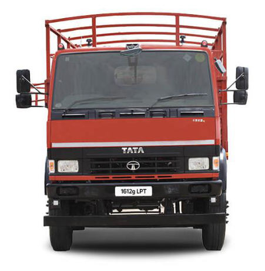
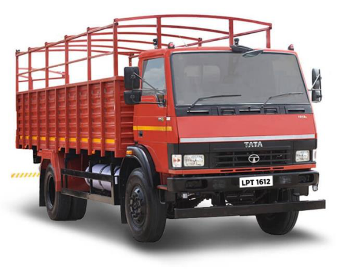
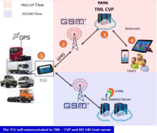
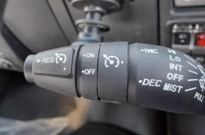
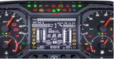
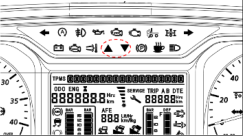
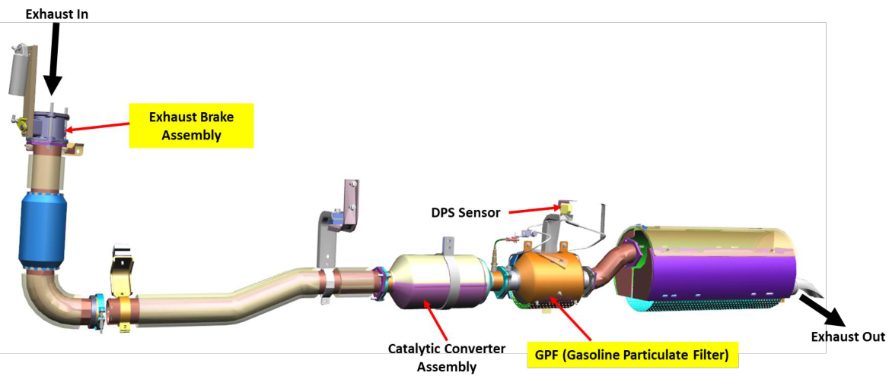
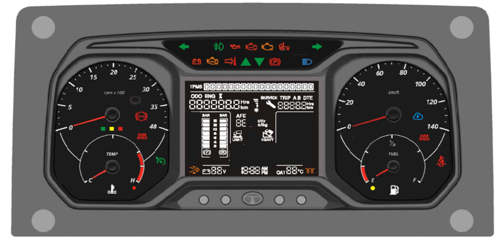
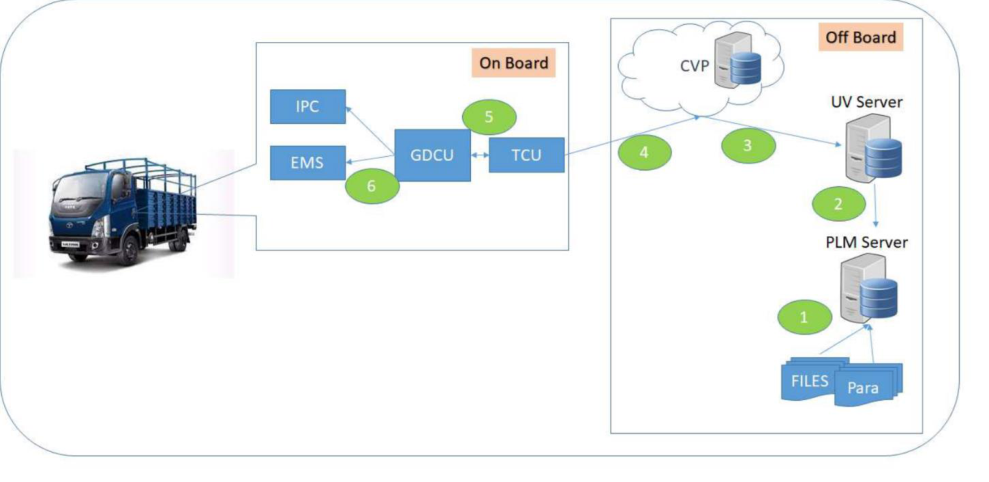
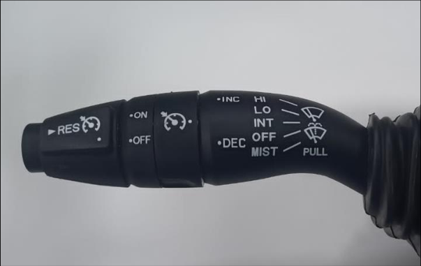

## _SERVICE CIRCULAR_ 

## **TATA** MOTORS 

**Model : LPT 1612g with 3.8 SGI TC CNG BS6 Phase-2 SC/ 2025 /36 Group : 00 Mar 2025 Truck** 

## **All Dealers / TASSs’,** 

**We are pleased to inform introduction of LPT 1612g with 3.8 SGI TC CNG BS6 Phase-2 Truck.** 

Representative picture of the vehicle is given below - 

## **We are enclosing the following details:** 

- Chassis type designation **(Annexure - 1)** 

- Technical Specifications **(Annexure - 2)** 

- Warranty and Free Service Schedule **(Annexure - 3)** 

-  Salient Features **(Annexure - 4)**  BS6 Phase-2 Exhaust System and New Sensors **(Annexure - 5)** 

-  New Instrument Cluster **(Annexure - 6)**  GDCU and FOTA Flashing **(Annexure - 7)** 

-  Cruise Control Function **(Annexure - 8)**  Service and Maintenance Schedule **(Annexure - 9)**  Recommended Oil and Lubricants **(Annexure - 10)**  Special Tools List **(Annexure - 11)** 

- EMS Diagnostic Software Details **(Annexure - 12)** 

## **CUSTOMER CARE (COMMERCIAL VEHICLE BUSINESS UNIT)** 

( _As per policy of Tata Motors to continuously improve their products, the company reserves the right to make changes of any nature on vehicles and aggregates without any obligation to incorporate them on previous vehicle)_ 

## – Annexure 1 CHASSIS TYPE DESIGNATION: 

|**Model**|**VC No.**|**Chassis barrel**|
|---|---|---|
|1612gLPT DCR39CBC 125B6M6|29000139000R|563042|
|1612gLPT DCR39HSD 125B6M6|29000239000R|563043|
|1612gLPT DCR45CBC 125B6M6|29004045000R|563080|
|1612gLPT DCR45HSD 125B6M6|29004145000R|563081|
|1612gLPT DCR49CBC 125B6M6|29004049000R|563082|
|1612gLPT DCR49HSD 125B6M6|29004149000R|563083|
|1612gLPT DCR53CBC 125B6M6|29004053000R|563084|
|1612gLPT DCR53CBC 125B6M6|29004153000R|563085|
|1612gLPT DCR49CBC 125B6M6|29003149000R|563101|
|1612gLPT DCR49HSD 125B6M6|29003849000R|563102|

## – Annexure 2 TECHNICAL SPECIFICATIONS 

|**Vehicle Model**|**1612g LPT** **DCR49CBC** **125B6M6 CX**|**1612g LPT** **DCR49HSD** **125B6M6 CX**|**1612g LPT** **DCR49CBC** **125B6M6**|**1612g LPT** **DCR49HSD** **125B6M6**|**1612g LPT** **DCR45CBC** **125B6M6**|
|---|---|---|---|---|---|
|**VC No**|**29003149000R**|**29003849000R**|**29004049000R**|**29004149000R**|**29004045000R**|
|**Chassis Type**|**563101 **|**563102 **|**563082 **|**563083**|**563080**|
|**ENGINE**||||||
|Engine Model|TATA 3.8 SGI TCIC BSVI|||||
|Engine Type|4 Cylinder Inline, water cooled, turbo-intercooled|||||
|Bore and Stroke|97 mm x 128 mm|||||
|Engine Capacity (cc)|3783 cc|||||
|Nos. of cylinders|4 Inline|||||
|Compression ratio|11.5 ± 1 : 1|||||
|Max Power|92 kW @2250 rpm  as per MOST/CMVR TAP 115/116|||||
|Max Torque|500 Nm at 1400-1600 rpm as per CMVR TAP 115/116|||||
|Firing Order|1-3-4-2|||||
|Turbo Charger|Yes|||||
|HP Pump|Common rail with electronic injectors with automatic advance|||||
|Air Filter|Dry type remote mounted|||||
|Fuel Filter|Particulate Filter|||||
|Oil Filter|Cartridge Filter|||||
|Capacity Of Cooling System|18 liters|||||
|Coolant|Water & Ethylene glycol, ratio 60:40, premixed|||||
|Engine Fan Type|E-Viscous fan|||||
|Exhaust System|Compatible with BS-VI & RDE Norms.|||||
|**FUELSYSTEM**||||||
|Type|CNG Fuel System, CNG cylindrical Tank|||||
|CNG Tank volume (Water Capacity)|550 Liters|550 Liters|440 Liters|440 Liters|440 Liters|
|**CLUTCH**||||||
|Outside diameter of clutch|330 mm Multistage|||||
|Engine Clutch Type|Single plate dry friction type|||||
|Type of Actuation|Hydraulically actuated with pneumatic assistance.|||||
|**GEARBOX**||||||
|Gear box Model|GBS-550 (6.9) Synchromesh with PTOP, Cable shift|||||
|No. of gears|6 Forward 1 Reverse|||||

|Gear Ratios|1st-6.9 , 2nd-4.02, 3rd-2.39 , 4th-1.46 , 5th-1.00, 6th–0.84, Rev-6.37.|1st-6.9 , 2nd-4.02, 3rd-2.39 , 4th-1.46 , 5th-1.00, 6th–0.84, Rev-6.37.|1st-6.9 , 2nd-4.02, 3rd-2.39 , 4th-1.46 , 5th-1.00, 6th–0.84, Rev-6.37.|1st-6.9 , 2nd-4.02, 3rd-2.39 , 4th-1.46 , 5th-1.00, 6th–0.84, Rev-6.37.|1st-6.9 , 2nd-4.02, 3rd-2.39 , 4th-1.46 , 5th-1.00, 6th–0.84, Rev-6.37.|
|---|---|---|---|---|---|
|**PROPELLERSHAFT**||||||
|Type|SPL055|||||
|**REAR AXLE**||||||
|Rear Axle Description|Single reduction hypoid gears, fully floating axle shafts.|||||
|Rear Axle Type & Model|Banjo RA 108RR|||||
|Rear Axle Ratio|6.43 (45/7)|||||
|Rear Axle Make|TML|||||
|**FRONT AXLE**||||||
|Front Axle Description|Heavy duty Forged I beam, Reverse Elliot type|||||
|Axle Make|TATA|||||
|Front Axle Designed Capacity|5.6T|||||
|**ELECTRICAL**||||||
|Battery|100 Ah capacity|||||
|Alternator Capacity|120 Amps, Multi groove|||||
|Starter Motor| 12V,2.2KW,TCO|||||
|Head Lamp|2 No's with 1.8% Inclination with HLL|||||
|Horn|1 Horn|||||
|EMS|Westport|||||
|**WHEELS & TYRES**||||||
|Tyre Size & Tyre Type|9.0R20 Tube Tyre|||||
|Front Tyre|9.0R20-16 PR RIB|||||
|Rear Tyre|9.0R20-16 PR LUG|||||
|No. Of Tyres|Front-2,Rear-4,Spare-1|||||
|Wheel Rims|7  x 20|||||
|**FRAME**||||||
|Frame Description|Ladder type heavy duty frame with riveted/bolted cross members Side members are of channel section|||||
||Depth-220 mm (max), Flange Width-60 mm, Thickness–7 mm|||||
|**BRAKES**||||||
|Service Brakes|Fully duplicated, full air S-CAM brake system|||||
|Front Brakes|Brake Liners-410(Dia) x 180 (width)|||||
|Rear Brakes|Brake Liners-410(Dia) x 180 (width)|||||
|Parking brake Description|Hand Operated, Spring actuated parking brake  acting on rear wheels|||||
|**STEERING**||||||
|Type|Power Assisted hydraulic type|||||
|Ratio|20.2:1 ZF, 20.4:1 Rane|||||
|Steering Gear Box|Re-circulating Ball type|||||
|**SUSPENSION**||||||
|Front Suspension|Parabolic spring|||||
|Rear Suspension|Leaf spring|||||
|Shock Absorber|Hydraulic double acting telescopic type at front only|||||
|**MainChassis Dimensions in mm**||||||
|Vehicle Overall Height (Unladen)|2520|3200|2520|3200|2520|
|Vehicle Overall Length|8860|8950|8860|8950|8320|
|Vehicle Overall Width|2270|2270|2270|2430|2270|
|Ground Clearance|~274mm|||||
|Minimum TurningCircle Dia.|18900|18900|18900|18900|15600|
|Wheel Base|4920|4920|4920|4920|4530|
|**PERFORMANCE**||||||
|Max. Geared speed|70 KMPH|||||
|Max. Gradeability at rated GVW|27.00%|||||
|**WEIGHT in Kg**||||||
|Gross Vehicle Weight (GVW)|16371|||||
|Kerb Weight (Unladen Weight)|4975|5935|4975|5935|4785|
|Max Payload|11336|10436|11336|10436|11586|
|Max. Permissible FAW|5671|||||
|Max Permissible RAW|10700|||||

|**Vehicle Model**|**1612g LPT** **DCR45HSD** **125B6M6**|**1612g LPT** **DCR39CBC** **125B6M6**|**1612g LPT** **DCR39HSD** **125B6M6**|**1612g LPT** **DCR53CBC** **125B6M6**|**1612g LPT** **DCR53CBC** **125B6M6**|
|---|---|---|---|---|---|
|**VC No**|**29004145000R**|**29000139000R**|**29000239000R**|**29004053000R**|**29004153000R**|
|**Chassis Type**|**563081 **|**563042**|**563043**|**563084 **|**563085**|
|**ENGINE**||||||
|Engine Model|TATA 3.8 SGI TCIC BSVI|||||
|Engine Type|4 Cylinder Inline, water cooled, turbo-intercooled|||||
|Bore and Stroke|97 mm x 128 mm|||||
|Engine Capacity (cc)|3783 cc|||||
|Nos. of cylinders|4 Inline|||||
|Compression ratio|11.5 ± 1 : 1|||||
|Max Power|92 kW @2250 rpm  as per MOST/CMVR TAP 115/116|||||
|Max Torque|500 Nm at 1400-1600 rpm as per CMVR TAP 115/116|||||
|Firing Order|1-3-4-2|||||
|Turbo Charger|Yes|||||
|HP Pump|Common rail with electronic injectors with automatic advance|||||
|Air Filter|Dry type remote mounted|||||
|Fuel Filter|Particulate Filter|||||
|Oil Filter|Cartridge Filter|||||
|Capacity Of Cooling System|18 liters|||||
|Coolant|Water & Ethylene glycol, ratio 60:40, premixed|||||
|Engine Fan Type|E-Viscous fan|||||
|Exhaust System|Compatible with BS-VI & RDE Norms.|||||
|**FUELSYSTEM**||||||
|Type|CNG Fuel System, CNG cylindrical Tank|||||
|CNG Tank volume (Water Capacity)|440 Liters|438 Liters|438 Liters|440 Liters|550 Liters|
|**CLUTCH**||||||
|Outside diameter of clutch|330 mm Multistage|||||
|Engine Clutch Type|Single plate dry friction type|||||
|Type of Actuation|Hydraulically actuated with pneumatic assistance.|||||
|**GEARBOX**||||||
|Gear box Model|GBS-550 (6.9) Synchromesh with PTOP, Cable shift|||||
|No. of gears|6 Forward 1 Reverse|||||
|Gear Ratios|1st-6.9, 2nd-4.02, 3rd-2.39, 4th-1.46, 5th-1.00, 6th–0.84, Rev-6.37.|||||
|**PROPELLERSHAFT**||||||
|Type|SPL055|||||
|**REAR AXLE**||||||
|Rear Axle Description|Single reduction hypoid gears, fully-floating axle shafts.|||||
|Rear Axle Type & Model|Banjo RA 108RR|||||
|Rear Axle Ratio|6.43 (45/7)|||||
|Rear Axle Make|TML|||||
|**FRONT AXLE**||||||
|Front Axle Description|Heavy duty Forged I beam, Reverse Elliot type|||||
|Axle Make|TATA|||||
|Front Axle Designed Capacity|5.6T|||||
|**ELECTRICAL**||||||
|Battery|100 Ah capacity|||||
|Alternator Capacity|120 Amps, Multi groove|||||
|Starter Motor| 12V,2.2KW,TCO|||||
|Head Lamp| 2 No's with 1.8% Inclination with HLL|||||
|Horn|1 Horn|||||
|EMS|Westport|||||
|**WHEELS & TYRES**||||||
|Tyre Size & Tyre Type|9 R20, Tube Tyre|||||
|Front Tyre|9 R20-16 PR RIB|||||
|Rear Tyre|9 R20-16 PR LUG|||||
|No. Of Tyres|Front-2,Rear-4,Spare-1|||||
|Wheel Rims|7  x 20|||||
|**FRAME**||||||

|Frame Description|Ladder type heavy duty frame with riveted/bolted cross members Side members are of channel section|Ladder type heavy duty frame with riveted/bolted cross members Side members are of channel section|Ladder type heavy duty frame with riveted/bolted cross members Side members are of channel section|Ladder type heavy duty frame with riveted/bolted cross members Side members are of channel section|Ladder type heavy duty frame with riveted/bolted cross members Side members are of channel section|
|---|---|---|---|---|---|
||Depth-220 mm (max), Flange Width-60 mm, Thickness–7 mm|||||
|**BRAKES**||||||
|Service Brakes|Fully duplicated, full air S-CAM brake system|||||
|Front Brakes|Brake Liners-410(Dia) x 180 (width)|||||
|Rear Brakes|Brake Liners-410(Dia) x 180 (width)|||||
|Parking brake Description|Hand Operated, Spring actuated parking brake  acting on rear wheels|||||
|**STEERING**||||||
|Type|Power Assisted hydraulic type|||||
|Ratio|20.2:1 ZF, 20.4:1 Rane|||||
|Steering Gear Box|Re-circulating Ball type|||||
|**SUSPENSION**||||||
|Front Suspension|Parabolic spring|||||
|Rear Suspension|Leaf spring|||||
|Shock Absorber|Hydraulic double acting telescopic type at front only|||||
|**MainChassis Dimensions in mm**||||||
|Vehicle Overall Height (Unladen)|3200|2520|3200|2520|2520|
|Vehicle Overall Length|8320|7360|7400|9530|7400|
|Vehicle Overall Width|2430|2270|2430|2270|2430|
|Ground Clearance|~274mm|||||
|Minimum TurningCircle Dia.|15600|13800|13800|18100|13800|
|Wheel Base|4530|3920|3920|5300|5300|
|**PERFORMANCE**||||||
|Max. Geared speed|70 KMPH|||||
|Max. Gradeabilty at rated GVW|27.00%|||||
|**WEIGHT in Kg**||||||
|Gross Vehicle Weight (GVW)|16371|||||
|Kerb Weight (Unladen Weight)|5620|4845|5635|4780|4870|
|Max Payload|10751|11526|10736|11591|11691|
|Max. Permissible FAW|5671|||||
|Max Permissible RAW|10700|||||

## **– Annexure 3 WARRANTY AND FREE SERVICE SCHEDULE** 

## **3.1 Warranty:** 

|**Model**|**Vehicle Warranty**|**Engine Warranty**|
|---|---|---|
|**LPT 1612g with 3.8 SGI TC** **CNG BS6 Phase-2 Truck**|36 months from the date of sale OR 3,00,000 Km whichever expires earlier|Same as Vehicle Warranty|

## **3.2 Free Service Schedule:** 

Below free services are applicable at the interval given below: 

|**Sl.** **No**|**Service**|**Kms covered (± 2000)**|**Days  (± 60)**|
|---|---|---|---|
|**1**|**Free PDI**|**At the time of delivery of vehicle**||
|**2**|**Free Wheel Alignment**|**3,000 to 5,000 Km**|**NA**|
|**3**|**First Free Service**|**20,000 Km**|**< 365 Days (1 Year)**|
|**4**|**Second Free Service**|**40,000 Km**|**< 730 Days (2 Year)**|
|**5**|**Third Free Service**|**60,000 Km**|**< 1095 Days (3 Year)**|

**Annexure – 4** 

## **SALIENT FEATURES** 

|**SN**|**Descriptions**|**Photo**|
|---|---|---|
|1|**3.8 SGI TC BS6 Engine** 3.8 SGI TC BS6 Engine with max engine output 92 kW @ 2250 rpm||
|2|**Gear Box-G550 - 6 Speed** Cable shift gearbox with reduced shifting efforts||
|3|**Modular Chassis Frame** Straight ladder type frame||
|4|**Cabin** Walk Through Cabin Driver Suspended Seats Tilt & tel steering column||
|5|**Air Deflector Mounting Provision** Total 8 , M8 tapped holes Better FE||
|6|**GDCU – Gateway Domain Controller Unit** Prevents unauthorized access to vehicle CAN network Performs FOTA function. Flashing of vehicle various ECUs remotely.||

- **Telematics**  Fleet Management Solution 

- 7  Track and Trace  Driving Behavior  Vehicle Performance 

- **Cruise control Function** (If applicable)  Helps driver to maintain a suitable vehicle speed 

- 8 without keeping foot on the accelerator pedal. **Note** : At least once **Brake** should have been pressed after starting the vehicle to activate Cruise Control. 

- 9 **FOTA** (Firmware-update Over The Air) **GSA** (Gear Shift Advisory) (If Applicable)  Gear Shift Advisor or indicator helps notify the 

- 10 driver to display the current gear during manual gear shifting and when it is appropriate to engage the next gear for optimum fuel economy. 

**– Annexure 5** 

## **- BS6 Phase 2 Exhaust System and New Sensor** 

||**New Sensor / Actuator**||
|---|---|---|
|**Sr. no.**|**Description**|**Image**|
|1|**GPF** **(Gasoline Particulate Filter)**  Gasoline particulate filters (GPF) are based on the proven wall-flow technology of diesel particulate filters. While the purpose of DPF is to mitigate particulate emissions from diesel engines, GPFs were developed to reduce fine particulate emissions from gasoline vehicles.||
|2|**Exhaust Brake** Exhaust brakes can prevent a vehicle from going downhill too fast.  If a driver transports a loaded vehicle and he needs to go downhill, the exhaust brake can prevent the vehicle from going too fast and it reduces the likelihood of an accident.||

**– Annexure 6** 

## **New Instrument Cluster** 

|FOTA (Firmware- update Over The Air)||It will illuminate for approx. 3 sec when ignition is switched ‘ON’. This Indicator Turns "ON" when Firmware Over The Air Update (FOTA) is Available & process initiation required. This Indicator will start "blinking" once the FOTA activity is initiated.|
|---|---|---|
|Cruise Control Function||It will illuminate when cruise control function in ‘ON’.|

**Annexure – 7** 

## **GDCU and FOTA Flashing** 

- GDCU stands for Gateway Domain Controller Unit. It acts as gateway between various CAN network ECUs/controllers 

- It prevents unauthorized access to vehicle’s CAN network. 

- GDCU Enables FOTA (Firmware over the Air) function. Any vehicle ECU can be flashed remotely without visit to any workshop. 

## **Architecture of GDCU and FOTA function** 

- Updated Calibration firmware released on PLM server, gets transferred to UV server. 

- From UV server, Cloud CVP (Connected Vehicle Platform) transfers firmware to particular chassis TCU (Telematics Control Unit). Updated firmware gets stored in memory of GDCU. 

- Driver will get intimation on instrument cluster by FOTA Tell Tale lamp              about new software available. 

- Pre-Conditions for FOTA flashing are to be satisfied to initiate process. 

   - Hand Brake Engaged 

   - Engine RPM = 0 , Vehicle speed = 0 

   - IGN – ON 

   - Battery Voltage – 12V 

- Once pre-conditions are satisfied, drive has to press Hazard switch           4 times (ON-OFF-ON-OFF) within 10 sec to start software update. 

- After driver authentication, GDCU will flash particular ECU. 

- Cluster will display following ID which denote which ECU being updated 

|Vehicle ECU|ID on cluster|
|---|---|
|EMS (Bosch)|06|
|EMS (Delph)|01|
|GDCU|20|
|TCU|25|
|Cluster|08/09|
|VECU|13|

- Flashing status and progress will be displayed on screen. 

   - **FOTA STARTED** text message shall appear only once for 4 Secs 

   - `o` **TIME : XXXMINS** text message shall appear for 4 Secs 

   - Cluster screen will go blank and ECU ID for which FOTA is initiated will be displayed. 

   - `o` Cluster will display **FOTA-XX-XXX%** percentage completion of software update `o` During FOTA in progress, FOTA tell-tale will keep on blinking 

- After successful flashing **FOTA SUCCESS** message will display on screen. Driver can drive the vehicle. If software update is unsuccessful then **FOTA FAIL - ECU NOT OK** or **FOTA FAIL - ECU OK** message will display on screen. 

- If FOTA fails then previous version flashing will be initiated with message on screen as **FOTA ROLLBACK** along with status and progress. Either **ROLLBACK SUCCESS** or **ROLLBACK FAIL** message will appear accordingly. If ROLLBACK FAIL message appear on display; visit to nearest Tata motors Authorized Service Station. 

- After **FOTA COMPLETE** message, tell-tale FOTA lamp will disappear from cluster. 

|**Do’s **|**Don’ts**|
|---|---|
|Regularly check for this tell-tale indication|Do not crank vehicle during software update in progress.|
|Educate the drivers to keep a watch for the tell- tale and guide them to authorize through hazard switch|Do not turn off ignition during software update in progress|
|Follow pre-condition requirement|Do not cut-off battery / Do not turn off battery switch during software update|
|Perform the software update when vehicle is parked in safe location and safe condition|Do not perform software update if battery voltage level is low|
||DO not leave vehicle unallocated while software update is in -progress|

*IPC: Instrument Panel & Cluster 

- *EMS: Engine Management System 

|**Sample Display Message**|**Display image**|
|---|---|
|TIME : XXXMINS||
|ROLLBACK SUCCESS||
|FOTA COMPLETE||

**– Annexure 8** 

## **Cruise Control Function (If Applicable)** 

- Cruise Control function helps driver to maintain a suitable vehicle speed without keeping foot on the accelerator pedal. 

- Cruise control function can be set **ON** or **OFF** by rotating left knob 

- When cruise control is ON, Tell-tale lamp will glow in instrument cluster. 

- Speed can be increased or decreased by 1 Km/hr. by rotating knob in front of **INC (Increase)** and **DEC (Decrease)** 

- To cancel cruise control temporarily, press either brake pedal or clutch pedal. 

- Cruise control can be resumed by pressing **RES (Resume)** button. 

## **Preconditions to start cruise control function** 

- Desired constant vehicle speed is above 40km/ph. 

- Vehicle is in 4[th] or 5[th] gear. 

## **Temporary Disengagement of cruise control** 

- Brake pedal or Clutch pedal is pressed 

- Speed falls below 30 km/h, when travelling uphill 

- Gear is changed 

## **Automatic Disengagement of cruise control** 

- Vehicle speed is below 30 km/h. 

- Low engine speed (< 1000 rpm ) 

- Vehicle speed sensor is disconnected or tampered or non-functional. 

**– Annexure 9** 

## **SERVICE AND MAINTENANCE SCHEDULE** 

## **9.1 Service Operations to be performed by Customer –** 

|**SN**|**OPERATION**|**FREQUENCY**|
|---|---|---|
|1|Check engine oil and coolant level. Topup,if necessary.|Daily|
|2|Carry out visual inspection of vehicle for leakages, traces of oil / fluid on ground,if any.|Daily|
|3|Check for switching sound of gas shut off solenoid valve after inserting ignition key.|Daily|
|4|Check whether CNG Fuel gauge in instrument cluster is indicating correctly, compared to highpressuregauge.|Daily|
|5|Check air filter service indicator for the red band. Contact nearest TATA Motors Authorised Workshop if red band appears. **Note - Please do not clean air filter element.**|Daily|
|6|Check for proper functioning of switches, gauges, warning lamps on instrument cluster,buzzers,all lights,other electrical controls.|Daily|
|7|Check for proper functioning of service brake, parking brake, LCRV and exhaust brake.|Daily|
|8|**Drive Belts**- Inspect the belts weekly. Check the belt for intersecting cracks. Attend,if required.|Weekly|
|9|**Air Tanks and Reservoirs (For Air Brake only)**- Open the drain cock on the air tank to drain any moisture accumulated in the air system. If oil is present, the air compressor system must be checked at TATA Motors authorised workshop.|Weekly|
|10|Check catalytic converter housingexterior for burn marks / damage.|Weekly|
|11|To check proper functioning of cylinder valves, close all the cylinder valves and start the engine. If engine does not stop by itself, get valves checked / replaced. Check that thepressuregauge shows full readingnow|Weekly|
|12|Check tyre pressure including spare wheel, inflate tyres to specified pressure if necessary.|Weekly|
|13|Check clutch, power steeringoil level. Topup,if necessary.|Monthly|
|14|Visual inspection of battery terminal/ post condition, electrolyte level, battery cable connections, battery mountings, If there are any abnormalities observed duringvisual inspection, request to visit at TATA Motors authorized workshop.|Monthly / 5000 Kms.|
|15|Check tyres for any abnormal tyre wear. If tyre wear noticed, wheel alignment to be checked immediately.|Monthly / 5000 Kms.|
|16|Lubricate all chassisgrease nipplepoints,if required|Monthly/ 5000 Kms.|
|17|Rotate the tyres as per recommendation. In case any abnormal tyre wear observed,rotation to be carried out immediatelyfor better tyre life.|Every 20000 Kms.|
|18|Check the wheel alignment.|Every20000 Kms.|
|19|Check head lampfocusing. Adjust if necessary.|As required|
|20|Check windshield washer water level. Topup,if necessary|As required|
|21|Wash the vehicle|As required|

## **9.2 Service Operations to be performed at Workshop:** 

## **SERVICE OPERATIONS TO BE PERFORMED AT WORKSHOP** 

|**SERVICE OPERATIONS TO BE PERFORMED AT WORKSHOP**|**SERVICE OPERATIONS TO BE PERFORMED AT WORKSHOP**|**SERVICE OPERATIONS TO BE PERFORMED AT WORKSHOP**|**SERVICE OPERATIONS TO BE PERFORMED AT WORKSHOP**|**SERVICE OPERATIONS TO BE PERFORMED AT WORKSHOP**|**SERVICE OPERATIONS TO BE PERFORMED AT WORKSHOP**|**SERVICE OPERATIONS TO BE PERFORMED AT WORKSHOP**|
|---|---|---|---|---|---|---|
||||||||
|**D=Daily, W=Weekly, M=Monthly, P=PDI, *=whichever is earlier**|||||||
|**SN**|**OPERATION**|**FREQUENCY**|**Checks by Customer**|||**PDI**|
||||**D**|**W**|**M**||
|**1**|**ENGINE**||||||
|1.1|Drain off Engine oil while hot. Change engine oil and oil filter. Clean drain plug & engine breather. Check engine oilpressure.|20,000 Kms. OR 1 Year*|||||
|1.2|Check condition of drive belts for water pump, alternator, fan, steering visually. Replace, if necessary.|20,000 Kms.||**W**||**P**|
|1.3|Check all drive belts for free rotation / damage: (a) Water pump (b) Belt Tensioner pulley (c) Belt Idler pulley (d) Fan pulley (e) Alternator pulley. Changeif necessary.|20,000 Kms.|||||
|1.4|Belt drive parts have to be compulsory changed.|80,000 Kms. OR 2 Years*|||||
|1.5|Check if red band appears on air filter Service indicator or 'Air filter clogging' indicator on instrument cluster is ON. Replace if necessary|20,000 Kms.|**D**|||**P**|
|1.6|If red band appears on service indicator, replace primary filter element. Replace secondary (Safety filter) during every 3rd replacement of primary filter. **(Note - Please do not clean air filter element with** **air)**|20,000 Kms.|||||
|1.7|Check proper sealing of air intake and exhaust system by checking hose, gaskets & pipe condition / proper tightness of clamps. Replace any defective item,if required.|20,000 Kms.|||||
|1.8|Check / replace if required pipes, clamps & hoses of engine lubrication / fuel / coolant / windshield washing system.|20,000 Kms.|||||
|1.9|Replace rubber hoses of engine lubrication / coolant. Take the vehicle to workshop if any leakage is noticed.|80,000 Kms. OR 2 Years*|||||
|1.10|Check cylinder head valve clearance (Tappet setting) & adjust,if necessary.|20,000 Kms.|||||
|1.11|Check for external clogging of radiator, intercooler, and condenser (If fitted), clean if necessary with compressed air&water.|20,000 Kms.|||||
|1.12|Replace Spark Plugs.|20,000Kms.|||||
|1.13|**Rubber boot along with Spring of Ignition coil:** Clean rubber boot and refit. Replace it if found cracked/damaged|20,000 Kms|||||
|1.14|Replacerubberboot of ignitioncoilalongwithSpring.|40,000Kms|||||
|1.15|Check coolant concentration and top up coolant, if required.|20,000 Kms.|||||
|1.16|**Drain cooling system**- Reverse flush. Check thermostat for proper operation. Refill system with fresh coolant. Use mixture of clean water & recommended anti-freeze agentinspecifiedratio.|300,000 Kms. OR 2 Years*|||||
|1.17|Check thermostat working & fan operation.|20,000 Kms.|||||
|1.18|Check for radiator mounting rubber bush. Replace, if required.Check& tighten radiator mounting.|20,000 Kms.|||||

|1.19|Check and tighten engine mounting rubber, if required.|20,000 Kms.|||||
|---|---|---|---|---|---|---|
|1.20|Check mounting of engine speed sensor, boost pressure sensor, air intake temperature sensor, coolant temperature sensor,vehicle speed sensor.|20,000 Kms.|||||
|1.21|Check cylinder head cover gasket condition for leakage and changeif necessary.|20,000 Kms.|||||
|1.22|Check for ECU errors with diagnostic system based onerror indication incluster,ifany.|20,000 Kms.|||||
|1.23|Check catalytic converter housing exterior for burn marks / damage.|20,000 Kms.||**W**||**P**|
|**2**|**FUEL SYSTEM**||||||
|2.1|Check for switching sound of gas shut off solenoid valve after insertingignition key|20,000 Kms.|**D**|||**P**|
|2.2|Check whether CNG Fuel gauge in instrument cluster is indicating correctly, compared to high pressure gauge.|20,000 Kms.|**D**|||**P**|
|2.3|To check proper functioning of cylinder valves, close all the cylinder valves and start the engine. If engine does not stop by itself, get valves checked / replaced. Check that the pressure gauge shows full reading now|20,000 Kms.||**W**||**P**|
|2.4|Check for corrosion on all CNG cylinders. Rectify, if corroded.|20,000 Kms.||||**P**|
|2.5|Check lambda sensor output (milli volt variation) its functionality.|20,000 Kms.|||||
|2.6|Replace CNG low pressure hoses.|80,000 Kms. OR 2 Years*|||||
|2.7|Replace high pressure gas filter cartridge and body O-ring.|60,000 Kms.|||||
|2.8|Clean HP gas filter and replace O-ring. **Filter cleaning procedure:**Close all cylinder valves and start the engine. Engine should stop on its own confirming that there is no gas in the system. Open high pressure filter cap and separate it from HP Filter body. Dismantle. Clean with air and refit.|20,000 Kms.|||||
|2.9|Replace the O-rings of CNG receptacle|300,000 Kms. OR 5 Years*|||||
|2.1|Clean High Pressure SolenoidValveinletfilter.|60,000Kms.|||||
|2.11|Replace High Pressure Solenoid Valve inlet filter.|100,000 Kms.|||||
|2.12|Recertification of cylinders as per gas cylinder rules to be carried out by competent authorities.|Every 3 Years|||||
|**3**|**CLUTCH**||||||
|3.1|Check for free play movement of clutch pedal. Adjust if necessary.|20,000 Kms.|||||
|3.2|**Gear Shifting**- Drive the vehicle by shifting all gears to ensure clutch functioning (engagement, disengagement and torque transmission) and replace appropriate components if found defective.|20,000 Kms.|||||
|3.3|Replace clutch fluid & carry out bleeding of system. Bleeding of clutch actuation system, In case of any complaints please check / replace affected parts.|80,000 Kms.|||||
|3.4|Overhaul clutch master, slave cylinder / clutch booster.|80,000 Kms.|||||
|**4**|**GEAR BOX**||||||
|4.1|Change oil in Gear Box. Drain while hot. Clean drain plug & breather.|120,000 Kms.|||||
|**5**|**FRONT AXLE**||||||

|5.1|Remove front hub caps, fill 3/4th full with wheel bearing grease & refit.**(For Non THU Bearing if** **applicable)**|20,000 Kms|||||
|---|---|---|---|---|---|---|
|5.2|Grease with grease gun: (a) Kingpins, (b) Tie rod ends, (c)Draglinkends|20,000 Kms|||||
|5.3|Remove front wheel hubs. Dismantle and clean bearing & other components. Replace damaged / worn out parts. Replace with fresh wheeI bearing grease and refit. Adjust wheel hub bearing play.**(For** **Non THU Bearing ifapplicable)**|1,60,000 Kms|||||
|**6**|**REAR AXLE**||||||
|6.1|Change oil in rear axle. Drain while hot. Clean drain plug and breather.|3,00,000 Kms|||||
|6.2|Check and adjust hub play, top up the grease ( If Required) **(For Non THU Bearing ifapplicable)**|20,000 Kms|||||
|6.3|Remove rear wheel hubs. Dismantle and clean bearings and other components. Replace damaged/ Worn-out parts. Repack with fresh wheel bearing grease and refit. Adjust wheel hub bearing play.**(For** **Non THU Bearing if applicable)**|160,000 Kms.|||||
|6.4|Adjust crown wheelthrust pads|20,000Kms|||||
|**For THU Bearing - Front and Rear Axle Wherever applicable**|||||||
|1|Inspection of front / rear hubs (wheel) 1. Check for any abnormal noise. 2. Check bearing hub play (Spec:-Hub play less than 120 micron). 3. Check grease leakage for front and oil leakage for rear by opening the HUB CAP. 4. Check for any water ingress by removing the Hub Cap. **(DO NOT DISTURB THE UNITIZED BEARING AND** **INTEGRATEDSEAL) **|20,000 Kms|||||
|2|Hub greasing is not required on THU bearing fitted vehicle.|NA|||||
|**7**|**PROPELLER SHAFT**||||||
|7.1|Check Propeller shaft splines for excessive wear and noise. Replace,if necessary.|20,000 Kms.|||||
|**8**|**BRAKES (For both Hydraulic and Air Brake System)**||||||
|8.1|Check for proper functioning of service brake, parking brake, LCRV and exhaust brake (if applicable). Adjust, if necessary.|20,000 Kms.|**D**|||**P**|
|8.2|During tyre rotation (with the wheels removed), Check for front & rear brakes uneven wear of brake linings and grease spilling on linings or past hub seals. Check all springs of brake shoe for no elongation. Attend,if necessary.|20,000 Kms.|||||
||**FOR HYDRAULIC BRAKES**||||||
|8.3|Change brakefluid & bleed the system.|40,000Kms.|||||
|8.4|Check functioning of Vacuum Booster, Tandem Master Cylinder & Wheel Cylinder. Overhaul, if necessary.|80,000 Kms. OR 2 Years*|||||
||**FOR AIR BRAKES**||||||
|8.5|Drain off air from all tanks. If condensed water is found, replace air drier desiccant cartridge.|20,000 Kms.||**W**||**P**|
|8.6|Check for oil droplets / excessive oil accumulation (slight traces of oil are acceptable) at air drier exhaust port. If yes, then carry out following activities: (a) Check/replace compressorpiston rings, (b) clean|20,000 Kms.|||||

||compressor head (c) Check / replace compressor outlet pipe in case of carbon formation, (d) clean oil separator.||||||
|---|---|---|---|---|---|---|
|8.7|Check for air dryer outlet pressure difference between cut-off and cut-in, which should be within 0.6 bar to 1.3 bar.|20,000 Kms.||**W**||**P**|
|8.8|Inspect torque plate, cam shaft, shoe seemly, dust shield, chamber bracket assembly, roller and fulcrum pin. Replaceif required.|40,000 Kms.|||||
|8.9|Conduct brake system routine**checks I**(Check for leakage, switches and gauges, brake pressure fill up time).|20,000 Kms.|**D**|||**P**|
|8.10|Conduct brake system routine**checks II**(Check opening / closing pressure of SPV, check valves for leakage, damage etc.)|200,000 Kms. OR 2 Years*|||||
|8.11|Dismantle and overhaul pneumatic aggregates of brake system. Clean / inspect & replace parts if necessary.|200,000 Kms. OR 2 Years*|||||
|8.12|Replace air drier desiccant cartridge and filter of air dryer / DDU.|200,000 Kms. OR 2 Years*|||||
|**9**|**SUSPENSION**||||||
|9.1|Check front & rear spring bushes, anti-roll bar bush, Cab spring eye bushes,replaceif required.|40,000 Kms|||||
|9.2|Check suspension. Attend, if required - Leaf springs for damage / sagging / bush wear out / U-bolt suspension arm & steering knuckle supports & rear leafspring arm.Suspensionbump stop.|40,000 Kms|||||
|9.3|Dismantle front & rear spring & cab mounting spring. Clean and inspect leaves. Apply graphite grease on leaves & re-assemble.|Every 1,20,000 Kms.|||||
|9.4|Check shock absorbers for leak / damage. Check shock absorber bush, replace if required.|40,000 Kms||**W**||**P**|
|9.5|Checkantirollbar fordamage / bush wearout.|40,000Kms|||||
|**10**|**STEERING (POWER / MECHANICAL)**||||||
|10.1|Check steering pipelines connections for leakages and rectify if any.|20,000 Kms.|||||
|10.2|Check power steering hydraulic limiter valve setting and peakpressure.|40,000 Kms.|||||
|10.3|Check steering wheel play & check for proper condition of ball joints & rubber boots of tie rod / drag link for looseness, damage, excess wear, dislodging etc. Replaceif necessary.|40,000 Kms.|||||
|10.4|Drain off hydraulic oil of power steering / mechanical steering. Replacefiltercartridge. Fill in freshoil.|160,000 Kms. OR 2 Years*|||||
|**11**|**WHEELS AND TYRES**||||||
|11.1|Check tyre pressure; inflate tyres to specified pressure, if necessary.|Daily|||||
|11.2|Rotate the tyres as per recommendation.|20,000Kms|||||
|11.3|Check for wheel nut tightness, for specified torque.|During every wheel change & 100 Km. after wheel change|||||
|11.4|Check wheel alignment. (**Note**- Wheel alignment to be done even after changingrelated suspension& steeringlinkage parts)|20,000 Kms OR if any abnormal tyre wear noticed*|||||
|**12**|**ELECTRICALS**||||||
|12.1|Check proper functioning of switches, gauges, lights, blinkers, warning lamps in instrument cluster.|20,000 Kms.|**D**|||**P**|

|12.2|Check battery mountings, Clean battery posts and terminals, tighten terminals & smear petroleum jelly. Check battery cells with cell tester and specific gravity of electrolyte with hydrometer. Check electrolyte level inbattery and top upif necessary.|20,000 Kms.||||**P**|
|---|---|---|---|---|---|---|
|12.3|Check horn mounting and functioning. Adjustment to be doneif required.|20,000 Kms.||||**P**|
|12.4|Check headlampfocusing. Adjustif necessary.|20,000Kms.|**D**|||**P**|
|12.5|**Check all electrical system health:**Ensure usage of genuine fuses with correct rating, All ECU, DC-DC converter, telematics device, earthling connections, proper routing / clamping of wiring, intactness of grommets.|20,000 Kms.|||||
|12.6|Check sensors & connectors for cleanliness & secure fitment.|After every wash|||||
|**13**|**CAB & LOAD BODY**||||||
|13.1|Check for any paint peeling, rusting & damage to body panels & structure allaround & underneath.|20,000 Kms.||||**P**|
|13.2|Check for proper functioning of doors, seat, and sun visors.Checkbodyforunusual noise.|20,000 Kms.||||**P**|
|**14**|**GENERAL**||||||
|14.1|Check & top up levels of: 1. Engine oil 2. Engine coolant 3. Windshield washer tank (As required)|20,000 Kms.|**D**|||**P**|
|14.2|Check & top up oil levels of: 1. Gear Box oil 2. Rear Axle oil 3. MechanicalSteering oil|20,000 Kms.||||**P**|
|14.3|Check & top up oil levels of: 1. Clutch oil 2. Brake oil (If Applicable) 3. Powersteering oil(If Applicable)|20,000 Kms.|||**M**|**P**|
|14.4|Check for / Rectify the leakages of 1. Oil (at Engine / Clutch / Gear Box / air conditioning (If fitted) / shock absorbers / Rear axle/ power steering) 2. CNG at tank, pipelines & engine 3. Engine coolant 4. Engine exhaust 5. Pneumatic (brake system)|20,000 Kms.|**D**|||**P**|
|14.5|Check and tighten all fasteners if necessary as per the check list #|20,000 Kms.|||||
|14.6|Washthevehicle.|AsRequired|||||
|14.7|Grease as perthelist ##|20,000Kms.|||**M**|**P**|
|14.8|Conduct road test for vehicle handling and functioning of aggregates.|20,000 Kms.|||||
|**14.5**|**# Checking of fasteners required Periodical Checking and Tightening**||||||
|a|**Engine peripherals**: Engine mounting & accessories mountings, all clamps, CNG tank brackets, air filter mounting, radiator mounting, thermostat, exhaust muffler, exhaust pipe mounting hangers & brackets, airducthose connections.|20,000 Kms.|||||
|b|**CNG Gas circuit**: Mountings of 3 way valve / CNG pressure transducer / receptacle / HP filter / LP filter / HP regulator/HPsolenoidvalve / Gas cylinder|20,000 Kms.|||||

|c||**Driveline**: Clutch housing, clutch booster, mounting of clutch master cylinder and slave cylinder, gear box mounting, gear shift mechanism, propeller shaft coupling flange, center bearing bracket, rear axle carrier housing mounting studs.|20,000 Kms.|||||
|---|---|---|---|---|---|---|---|
|d||**Steering**: Steering gear box bracket mounting bolts, pitman arm, drag link, tie rod, relay arm, steering column.|20,000 Kms.|||||
|e||**Suspension**: Anti roll bar mounting, shock absorber mounting, leaf springs ‘U’ bolts, nuts of spring wedge bolts, springhangerbracket & slide support bracket|20,000 Kms.|||||
|f||**Brakes**: Wheel cylinders, Brake chambers, spring actuators & other brake valves mountings, hydraulic / pneumatic lines, anchor plate, air tanks mounting, airline clamps, exhaust brake valve mounting bolts, relay valve mounting, solenoid valve mounting, modulator valvemounting.|20,000 Kms.|||||
|g||**Electricals**: Ignition coil connectors, starter motor, and alternator, battery mounting bolts, wiper motor, switches & gauges, head lamp, tail lamp, blinker lamp.|20,000 Kms.|||||
|h||**Wheels & Tyres**: wheel mounting nuts, mounting of sparewheelcarrier.|20,000 Kms.|||||
|i||**Cab**- Cab mountings, mounting of cab lock and cab springs, Seats, RVM, door hinges, door locks, door strikerplates, bodymountings.|20,000 Kms.|||||
|j||**General**: Apart from above please check visually any other fastenersfor loosening.|20,000 Kms.|||||
|**14.7**||**## List of items requiredperiodic Greasing**||||||
|a||**Clutch**: Clutch release bearing, clutch cross shaft, clutch pedal bush|20,000 Kms.|||**M**|**P**|
|b||**Front Axle**: King pin|20,000 Kms.|||**M**|**P**|
|c||**Prop shaft**:UJ cross joints, sliding yoke (also check the conditionof rubberboot), centerbearing|20,000 Kms.|||**M**|**P**|
|d||**Steering** : Steering tie rod ends, ball joints, drag links, center link, idler arm, spindle / sleeves, column|20,000 Kms.|||**M**|**P**|
|e||**Brake:** Front and rear Brake S-camshaft bushes. (For airbrake only)|20,000 Kms.|||**M**|**P**|
|f||**Lubricate with oil can-** Pinion bushing of starter motor and wiper & motor linkages. Door hinges, outer door handle, door latches, dove tails & striker plates, bonnet stay rod, pivot pins & luggage boxdoor|20,000 Kms.|||**M**|**P**|

## **– Annexure 10** 

## **RECOMMENDED OIL AND LUBRICANTS** 

|**SN**|**AGGREGATES**|**QUANTITY**|**FLUID TYPE /** **GRADE**|**RECOMMENDDED** **BRANDS**|
|---|---|---|---|---|
|1|Engine oil (including oil filter)|**A - During scheduled services**- 14.5 Ltrs (Including oil filter). **B - For Green / New Engine Assy** (Including oil filter) -16 Ltrs. **Ensure oil topped up to max level**|TMGO Gas Engine Oil 15W40 LONG LIFE|**TMGOGEO15W40LL***|
|2|Coolant|18 Ltrs.|Non-Amino Base Coolant Concentrate meeting SS 7721 (Water & Ethylene glycol, ratio 60:40, premixed)|**TATA MOTORS**- Coolant Type 2, Ultra Long Life, SS7721 Part number - 55120860665|
|3|Gear Box (GB- 550)|5.7 Ltr|SAE 80W90 Long drain|TATA MOTORS - TATA Motors Genuine Gear Oil 80W90 LL|
|4|Rear Axle (RA108 RR)|8.6 Ltrs|ProFE SAE 80W90 LL with SS6592|TATA MOTORS - TATA Motors Genuine ProFE LL 80W90 Axle Oil|
|5|Power Steering Oil| 3 Ltrs.|Dexron II D|**TATA MOTORS**- TATA Genuine Power Steering Oil|
|6|Clutch Fluid|650 ml|DOT 4|**TATA MOTORS -** TATA Genuine Brake Fluid (DOT 4)|
|7|Wheel bearing grease**(For Non** **THU Bearing if** **applicable) **|Front Hub – 450gms/hub Rear Hub - 650 gms/hub|Synthetic Grease|**TATA MOTORS**- TATA Genuine Synthetic Grease|
|8|All Grease Nipples|As required|AP2 Grease|**TATA MOTORS**- TATA Genuine AP2 Grease|

**Notes:-** For engine oil quantity related change details, Please refer below released service circular. 

- 1) **SC / 2024 / 140** - Introduction of 14 Ltrs engine oil sump (Higher engine oil capacity sump) and amendment in engine oil quantity in LPT CNG PH2 trucks. 

**Annexure - 11 SPECIAL TOOL LIST** 

**Note** – For existing special tools, refer Workshop manual. 

## **Newly added tools for BS6 Phase-2 vehicles** 

||||**New Additional**|**Special Tool**||
|---|---|---|---|---|---|
|**Sr.No**|**Aggregate**|**Tool Part No**|**Tool Description**|**Tool Image **|**Tool Use**|
|1|CNG Tank|5545 5890 4702|CNG Valve R&R tool|||

## **Annexure - 12** 

## **EMS DIAGNOSTIC SOFTWARE DETAILS** 

All Workshops to ensure Garuda Hardware Kit available & Diagnostic Software is installed on Laptop to do diagnostic of all vehicle. 

|**PART NAME**|**PART NUMBER**|**PHOTO**|**PHOTO**|**PHOTO**|
|---|---|---|---|---|
|**Laptop based Software** TDS - ICV, HCV, I&LCV, SCV & PICK UPS Updated Version|210323999949||||
|TFS –  ICV, HCV, I&LCV, SCV & PICK UPS Updated Version|210323859941||||
|**Hardware Kit** GES -Garuda II-USB_ ENABLED_FULL_SET Kit : (Garuda Hardware + USB Cable + OBDII DLC Cable )|210324769907||||
|**Hardware Child Parts** GES - Garuda II – USB Cable|210324769908||||
|**Hardware Child Parts** GES – Garuda II – OBD II – Cable (DLC CABLE )|210324769909||||

